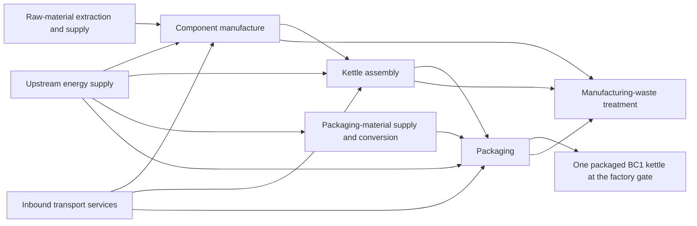

# Goal and Scope Definition

Date: 2026-10-08 (Asia/Seoul).
Status: **goal and production boundary agreed; the user has refined the unit to one conforming packaged product.** Initial foreground inventory scenarios have been calculated; upstream LCI and LCIA remain pending.

## 1. Goal definition

> The goal of this study is to learn and apply the LCA procedure by estimating the cradle-to-gate global warming potential, using a 100-year time horizon (GWP100), of one manufactured and packaged BC1 1 L plastic electric kettle, identifying the main material and process contributions, and examining how selected background-data choices influence the result.

| Element | Definition |
|---|---|
| Reason | Practical learning of transparent and reproducible LCA modelling |
| Intended application | Understand production-stage climate contributions and effects of documented data choices |
| Audience | Student, instructor, classmates and public GitHub readers |
| Comparison | Alternative background-data scenarios for the same BC1 specification |
| Main output | GWP100 in kg CO2-eq per packaged kettle, contributions and limitations |
| Intended use of findings | Identify contributions and data choices that deserve further investigation |
| Limits | No whole-life efficiency claim, overall environmental ranking or commercial-product superiority assertion |

The user accepted the educational goal and production boundary, then proposed an explicit conforming-output production functional unit. The audience and detailed reporting provisions above implement the previously requested public course submission. No ISO conformity or independent critical-review claim is made.

## 2. Scope: product system and boundary

A product system is the connected collection of processes modelled to provide an output. The kettle is the physical product; its product system includes the upstream activities needed to manufacture and package it.

> The product system comprises the raw-material supply chains, component manufacture, assembly and packaging required to deliver one BC1 kettle at the factory gate, including associated energy supply, inbound transport and manufacturing-waste treatment.

This is a conceptual diagram, not a quantified inventory. Exact conversion routes, transport legs and energy inputs remain to be established. Upstream energy and transport already represented in datasets must not be counted twice.

| Boundary item | Treatment |
|---|---|
| All 12 BOM entries | Include |
| Raw-material extraction, refining and production | Include relevant upstream chains |
| Component conversion, assembly and packaging | Include; determine missing inputs during inventory |
| Energy supply and inbound transport | Include; inspect existing coverage before additions |
| Manufacturing losses and scrap | Include; resolve internal recycling and external treatment |
| Customer delivery after the factory gate | Exclude from baseline |
| Water heating, standby, maintenance and replacements during use | Exclude from baseline |
| End of life of the used kettle and consumer packaging | Exclude from baseline |
| Infrastructure/capital goods | Preserve and disclose background coverage; separate foreground additions unresolved |

The boundary is **cradle-to-gate**, from raw-material supply to the packaged product leaving manufacturing. It is broader than factory operations alone. Manufacturing waste remains in scope even though the used product's end of life is excluded.

## 3. Production functional unit, declared unit and reference flow

For this manufacturing study, the function is **to provide a conforming BC1 kettle ready to leave the factory**. The user's proposed good-output basis is reasonable when the quantity, product specification, quality requirement and boundary are explicit.

> Provision of one conforming, fully assembled and packaged BC1 1 L electric kettle at the factory gate.

This is the study-specific production functional unit. The classroom's declared unit still describes the same physical output: one packaged kettle. This wording does not quantify the appliance's lifetime water-heating service and does not establish comparability with alternative appliances.

| Term | Application |
|---|---|
| Production function | Provision of a conforming BC1 kettle ready for shipment |
| Product service function | Heating water using electricity; use-stage service is outside this study |
| Production functional unit | One conforming, assembled and packaged BC1 kettle at the factory gate |
| Declared unit / output reference flow | One accepted packaged kettle, containing 723.00 g product and 137.80 g packaging |
| Quality requirement | Matches the modelled BC1 specification and passes assembly/functional inspection; actual acceptance thresholds remain unknown |
| Inventory scaling | Include inputs consumed for rejects as well as accepted output |
| Result unit | kg CO2-eq per conforming packaged kettle |

The 1 L rating is capacity. A defect rate is not necessary to define the functional unit; it is an inventory parameter controlling inputs per good output. Under the user's chosen illustration, inspection follows complete assembly and precedes packaging, without rework. Actual rejection is unknown; 0%, 2% and 5% are illustrative sensitivity values. [Inventory development](inventory.md) documents equations, simplifications and limitations.

A functional unit is a quantified performance definition, so quality/specification matters in addition to counting units. Merely changing the label or assuming a defect rate does not establish functional equivalence. Comparisons of water-heating efficiency or lifetime service would require their own service-based unit and expanded modelling.

## 4. Detailed scope choices to resolve

| Choice | Current position |
|---|---|
| Modelling approach | Attributional accounting proposed: assign production-chain burdens to the kettle; market responses are not modelled |
| Geography and time | Unknown; propose a representative manufacturing scenario during inventory. Distinguish BOM source date, dataset years and study date |
| Data strategy | One primary database, TianGong or USLCI, plus comparison scenarios |
| Data quality | Assess technology, geography, time, completeness and traceability |
| Allocation/recycling/scrap | Unknown; inspect background conventions and decide foreground treatment before calculation |
| Cut-offs | Proposed: no deliberate omission of BOM entries by mass alone; justify other exclusions |
| Impact coverage | GWP100 first; exact method/version and CF coverage unresolved |
| Uncertainty | Record qualitative limitations throughout; define sensitivity cases after identifying consequential assumptions |
| Review/reporting | English deliverables; discuss findings at each phase; no independent critical review performed |

Open fields are not finalized defaults. If inventory evidence requires a scope revision, document the reason and consequences.

## 5. Interpretation throughout the study

Interpretation asks whether choices and findings support the goal. Apply it throughout the study and consolidate conclusions after impact assessment.

| Phase | Interpretation questions | Record |
|---|---|---|
| Goal and scope | Does the boundary answer the question? Is the unit appropriate? Which conclusions are excluded? | Rationale, limits and unresolved choices |
| Inventory | Are required processes covered? Are proxies representative? Do units and balances agree? Are burdens missing or duplicated? | Data-quality and gap assessment; justified corrections |
| Impact assessment | Are relevant emissions characterized? What drives GWP100? How sensitive are results to important choices? | Contributions, coverage, sensitivity and qualified conclusions |
| Final synthesis | Which conclusions remain supported? What additional data would improve confidence? | Recommendations limited to the agreed goal |

**Current interpretation:** the agreed design supports a production-stage climate estimate for a fixed specification and transparent data-choice comparisons. It does not yet support any numerical GWP100 result or contributor ranking. It cannot establish a full-life climate result, use efficiency or performance in other impact categories. Geography, CF method and important manufacturing inputs remain unresolved.

## References

- [Exercise and common declared unit](https://tiangong-lca-decision-lab.ecodino73.chatgpt.site/).
- [ISO 14040 public framework description](https://www.iso.org/standard/37456.html).
- [JRC ILCD Handbook, detailed guidance](https://publications.jrc.ec.europa.eu/repository/bitstream/JRC48157/ilcd_handbook-general_guide_for_lca-detailed_guidance_12march2010_isbn_fin.pdf), section 6.4 on functional units and reference flows.
- [UNEP Life Cycle Initiative interpretation terminology](https://www.lifecycleinitiative.org/activities/life-cycle-terminology-2/).
